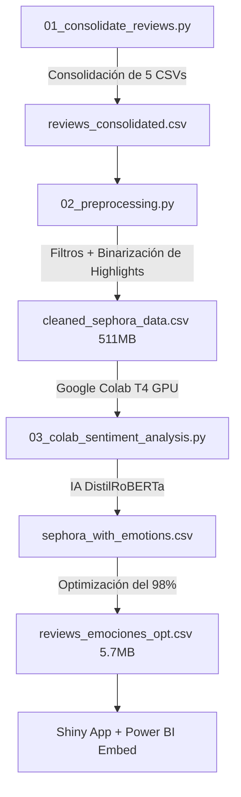

# DistilRoBERTa Sephora Analytics 🚀🤖

> **Plataforma de Inteligencia de Negocios y Minería de Opiniones a Grado Industrial.**

[](https://www.python.org/)
[](https://shiny.posit.co/py/)
[](https://powerbi.microsoft.com/)
[](https://huggingface.co/)

Una plataforma avanzada de **Procesamiento de Lenguaje Natural (NLP)** e **Inteligencia de Negocios (BI)** que procesa, limpia y analiza las emociones de más de **340,000 reseñas históricas** de productos de Skincare y Haircare en Sephora (2008-2023).

---

## 🏗️ Arquitectura del Proyecto (Por Pasos)

El proyecto está diseñado bajo una arquitectura modular y escalable dividida en fases claras:



### 🔹 Paso 1: Consolidación de Datos
*   **Script**: `scripts/01_consolidate_reviews.py`
*   **Lógica**: Une 5 datasets fragmentados de Kaggle que suman más de **1.1 millones de registros** brutos de forma segura y veloz en un solo archivo maestro.

### 🔹 Paso 2: Preprocesamiento de Grado Industrial
*   **Script**: `scripts/02_preprocessing.py`
*   **Lógica**: 
    *   Aplica un filtro inteligente de 37 términos clave del cuidado de la piel y cabello.
    *   Binariza la columna `highlights` usando `MultiLabelBinarizer`, expandiendo los "tags" (como *Vegan*, *Clean at Sephora*, *Cruelty-Free*) en **150 columnas independientes**.
    *   Normaliza tipos de datos y fechas para garantizar compatibilidad total con Power BI.

### 🔹 Paso 3: Análisis de Emociones con IA (DistilRoBERTa)
*   **Script**: `scripts/03_colab_sentiment_analysis.py`
*   **Lógica**: Diseñado para ser ejecutado en Google Colab con aceleración por hardware (T4 GPU). Clasifica el texto de las reseñas en las **7 emociones básicas del modelo de Ekman** (*Alegría, Tristeza, Miedo, Ira, Desagrado, Sorpresa y Neutral*) en menos de 45 minutos.

### 🔹 Paso 4: Visualización Ejecutiva (Power BI + Shiny App)
*   **Lugar**: `app/app.py`
*   **Estética Sephora Premium**: Diseñado en un Modo Oscuro profundo con acentos de color neón.
*   **El truco del 98%**: Comprime el dataset maestro de 511 MB a solo **5.7 MB** eliminando las columnas no visuales. Esto hace que el servidor de Shiny cargue en **milisegundos** y no se cuelgue en la nube.
*   **Doble Vista**:
    *   *Vista Nativa*: Gráficas rápidas de series de tiempo, volumen y mapas de calor usando matplotlib/seaborn adaptados al tema oscuro.
    *   *Vista Integrada*: Incrustación limpia del reporte ejecutivo de **Power BI Desktop**.

---

## 🛠️ Ejecución Local

### 1. Clonar el repositorio e instalar dependencias:
```bash
git clone https://huggingface.co/spaces/tu-usuario/distilroberta-sephora-analytics
cd distilroberta-sephora-analytics
pip install -r app/requirements.txt
```

### 2. Correr la aplicación de Shiny:
```bash
cd app
shiny run --reload app.py
```
*La bandera `--reload` permite que el navegador se actualice automáticamente cada vez que guardes cambios en el código.*

---

## 🐳 Despliegue en Hugging Face Spaces (Docker)

El proyecto viene con su propio `Dockerfile` corporativo listo para producción:

```dockerfile
FROM python:3.9-slim
WORKDIR /code
COPY ./requirements.txt /code/requirements.txt
RUN pip install --no-cache-dir --upgrade -r /code/requirements.txt
COPY . .
CMD ["shiny", "run", "app.py", "--host", "0.0.0.0", "--port", "7860"]
```

Al subir los archivos del directorio `app/` a tu Space configurado con la plantilla **Docker**, Hugging Face compilará y desplegará la app automáticamente.
